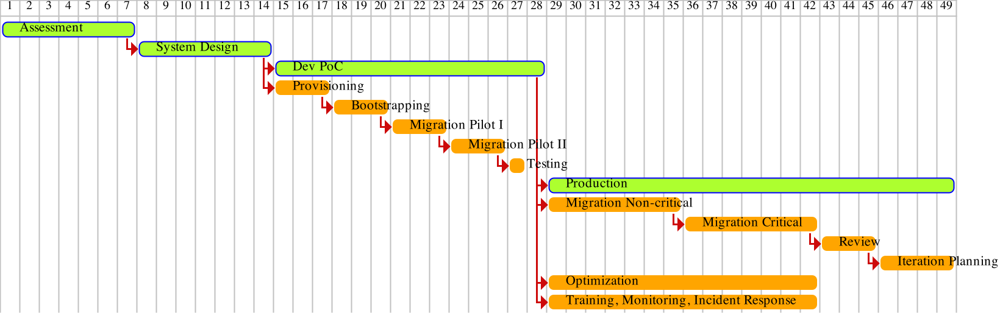

# Project Plan and Timeline

## Table of Contents
1. [Assessment](#assessment)
2. [System Design](#system-design)
3. [Dev Proof of Concept](#dev-proof-of-concept)
   1. [Provisioning](#provisioning)
   2. [Bootstrapping](#bootstrapping)
   3. [Migration Pilot](#migration-pilot)
   4. [Testing](#testing)
4. [Production](#production)
   1. [Migration](#migration)
   2. [Training and Operations](#training-and-operations)
   3. [Optimization](#optimization)
   4. [Review](#review)
   5. [Iteration Planning](#iteration-planning)

### Assessment
The first step before everything starts is assessment. This part is to ensure whether the plan is make sense by assess
our goals with our current state. This step also helps discover potential issues early on.

### System Design
The next step is system design. This step will mostly research what our system will be look like by reflecting 
our current condition. After that make a conclusion how the system will be in final. Hands-on research will likely 
done at this step, too.

### Dev Proof of Concept
Build a prototype for proof of concept on development environment, consisting several sub-steps.

#### Provisioning
This is focusing more on infrastructure provisioning like preparing the networks, instances and clusters. It's also
cover provisioning for user - system interfacing (VPN, bastion, etc).

#### Bootstrapping
After the infrastructure provisioning, move on to bootstrap the operational infrastructure such as observability, CI/CD
infra, could also include secrets management, or any other related to operational infrastructures.

#### Migration Pilot
When the infrastructure itself ready, continue to migration pilot of current services in dev environment. This part will
separate into two: stateless migration, and stateful migration. Because, both of them are different and might have
different behaviour and process.

#### Testing
This part will include end-to-end testing from the infrastructure itself to services. It could be UAT, integration tests
, etc.

### Production
#### Migration
This migration will split into two parts: non-critical, and critical. Non-critical services will have lower risks 
compared to critical services. Sometimes, critical services might have their own process on migration process so the 
migration hopefully seamless and not impacting end-users / customers.

#### Training and Operations
New system might changes some or entire process. Training will help reduce the overhead. Another things is that any
operations might changes, so new support transition could be done here, monitoring and incident management also might 
need to be updated to new process.

#### Optimization
On the migration period there might be some insight on how to optimize current process. This is not limited to 
documentation improvement, tooling if needed, etc.

#### Review
After the migration period, there will be a review. This will help on how was the process and the results and measure 
the success rate. This step also help on answering what is the next step, or missing parts.

#### Iteration Planning
Planning for the next iteration, it could be decommission, enforcement, refinement, etc.