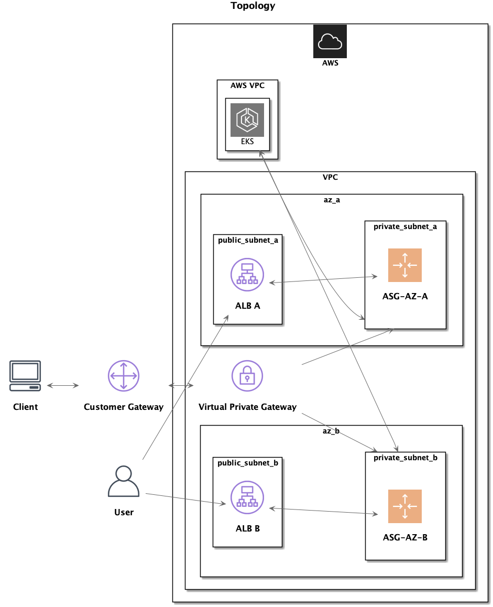

# Topology

## Explanation
> NOTE: This topology assuming using AWS platform

1. Use a VPC that has multi-tier design (private, public) with multiple AZ
2. Assuming kubernetes using EKS, worker nodes are deployed in each private subnet
3. Each public facing services will be accessed through ALB in public subnet, could be through Ingress or LoadBalancer
4. Connection between client and API server secured through VPN